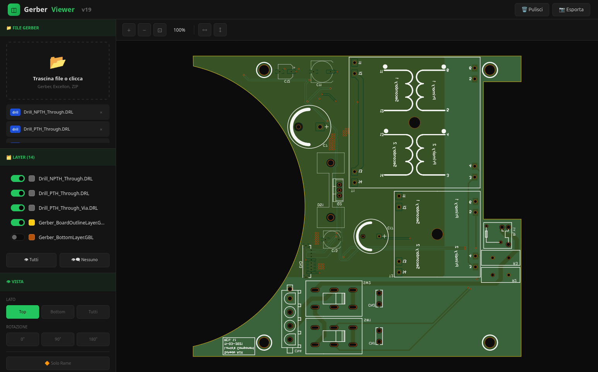

Un visualizzatore di file Gerber e Excellon moderno, leggero e completamente client-side. Nessun server richiesto, funziona direttamente nel browser.



## ✨ Caratteristiche

- **100% Client-Side** - Nessun upload su server, i tuoi file rimangono sul tuo computer
- **Supporto formati multipli** - Gerber RS-274X, Excellon drill, file ZIP
- **Rendering accurato** - Supporto per aperture C, R, O, P e macro
- **Gestione layer** - Visualizza/nascondi singoli layer, viste predefinite (Top/Bottom)
- **Solder mask realistica** - Rendering semi-trasparente con aperture pad
- **Fori e slot** - Supporto completo per drill e fori ovali (G85)
- **Colori PCB** - Verde, blu, rosso, nero, bianco, viola
- **Strumenti di navigazione** - Zoom, pan, rotazione, mirror
- **Esportazione PNG** - Salva l'anteprima come immagine
- **Statistiche** - Dimensioni scheda, conteggio fori, tabella tool

## 🚀 Demo

Apri `index.html` nel tuo browser oppure visita: [GitHub Pages Demo](https://quakef4.github.io/Visualizzatore-Gerber-web/)

## 📁 Formati Supportati

### Gerber (RS-274X)
| Estensione | Descrizione |
|------------|-------------|
| `.gtl` | Top Copper |
| `.gbl` | Bottom Copper |
| `.gts` | Top Solder Mask |
| `.gbs` | Bottom Solder Mask |
| `.gto` | Top Silkscreen |
| `.gbo` | Bottom Silkscreen |
| `.gko` / `.gm1` | Board Outline |
| `.gbr` / `.ger` | Generic Gerber |

### Excellon Drill
| Estensione | Descrizione |
|------------|-------------|
| `.drl` | Drill file |
| `.xln` | Drill file (alternativo) |
| `.txt` | Drill file (se contiene "drill" nel nome) |

### Archivi
| Estensione | Descrizione |
|------------|-------------|
| `.zip` | Archivio contenente file Gerber/Drill |

## 🎮 Utilizzo

1. **Carica file** - Trascina i file nell'area di drop oppure clicca per selezionarli
2. **Naviga** - Usa la rotella del mouse per lo zoom, trascina per spostarti
3. **Layer** - Clicca sui toggle per mostrare/nascondere i layer
4. **Vista** - Seleziona Top, Bottom o Tutti per cambiare vista
5. **Colori** - Scegli il colore della solder mask
6. **Esporta** - Clicca su "Esporta" per salvare come PNG

## 🛠️ Installazione

### Opzione 1: Uso diretto
Scarica `index.html` e aprilo nel browser. Fine!

### Opzione 2: GitHub Pages
1. Fai fork di questo repository
2. Vai su Settings → Pages
3. Seleziona branch `main` e cartella `/ (root)`
4. Il tuo viewer sarà disponibile su `https://tuousername.github.io/gerber-viewer/`

### Opzione 3: Server locale
```bash
# Con Python
python -m http.server 8000

# Con Node.js
npx serve .

# Con PHP
php -S localhost:8000
```

## 🔧 Tecnologie

- **HTML5 Canvas** - Rendering 2D
- **JavaScript ES6+** - Logica applicativa
- **JSZip** - Estrazione archivi ZIP (via CDN)
- **CSS3** - Interfaccia moderna dark theme

## 📋 Roadmap

- [ ] Rendering 3D con Three.js
- [ ] Misurazione distanze
- [ ] Esportazione SVG
- [ ] Supporto Gerber X2
- [ ] Layer interni (multilayer)
- [ ] Netlist e DRC base

## 🐛 Problemi Noti

- Alcune aperture macro complesse potrebbero non renderizzare correttamente
- File Gerber con formati non standard potrebbero richiedere aggiustamenti

## 🤝 Contribuire

Le pull request sono benvenute! Per modifiche importanti, apri prima una issue per discutere cosa vorresti cambiare.

1. Fai fork del progetto
2. Crea un branch per la feature (`git checkout -b feature/nuova-feature`)
3. Commit delle modifiche (`git commit -m 'Aggiunge nuova feature'`)
4. Push sul branch (`git push origin feature/nuova-feature`)
5. Apri una Pull Request

## 📄 Licenza

[MIT](LICENSE) - Sentiti libero di usare questo progetto come preferisci.

## 🙏 Crediti

Sviluppato con ❤️ per la community dei maker e progettisti PCB.

---

**Nota**: Questo viewer è pensato per anteprime rapide. Per la produzione, usa sempre i file Gerber originali e verifica con il tuo produttore PCB.
